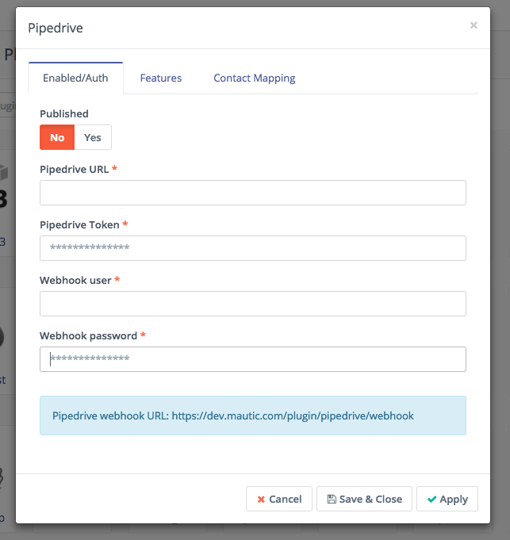
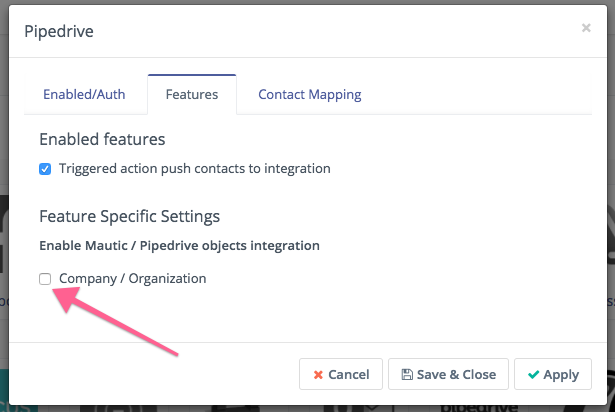
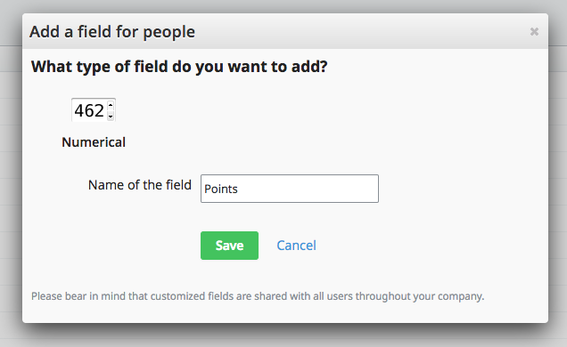
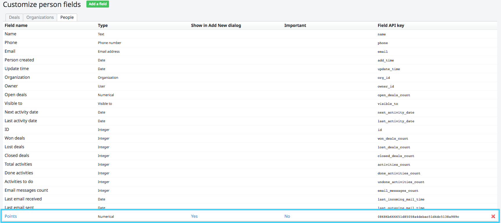
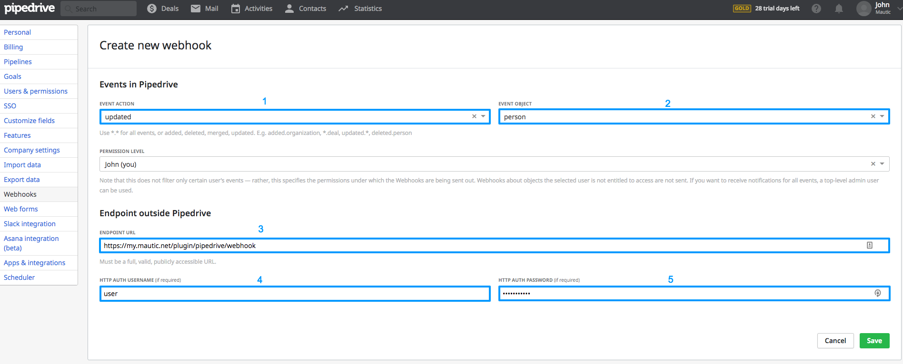

# Mautic - Pipedrive CRM plugin

This plugin allows for synchronization between Mautic and Pipedrive. If you don't have the Pipedrive account yet, create it here: https://www.pipedrive.com

# Configure the plugin in Mautic
To integrate Mautic with Pipedrive, fill out the following fields:

1. Pipedrive URL: Pipedrive API URL
2. Pipedrive Token: Pipedrive API token
3. Webhook user: the username of your choice (used in Pipedrive webhooks)
4. Webhook password: the password of your choice (used in Pipedrive webhooks)

Get the Pipedrive URL and API Token from Pipedrive. The API URL looks just like your own Pipedrive URL, but you have to add _/v1_ at the very end. In this example the URL will look like this: `https://my-test-company.pipedrive.com/v1`.

When you are filling out the form for the first time, set Published field to No. When you save the form and open the configurator again, you will be able to map the fields pulled from the Pipedrive API with Mautic fields. Having mapped the fields correctly, activate the integration by setting Published to Yes to start the synchronization.

**Be extra careful when matching the fields to make sure that the correct data is saved.**

# Features

### Company / Organization Synchronization

To enable Company/Organization Synchronization, go to Features tab and tick *Company / Organization*:

After closing and re-opening the window you will be able to map the company/organization fields – they will be pulled from Pipedrive automatically.

### Owners Synchronization

The plugin can also assign Owners to Lead/Person and Company/Organization. If you have a user with the same e-mail address both in Pipedrive and in Mautic, the plugin will synchronize the Owner automatically.

### Points Field Synchronization

The plugin can synchronize Points field as well. To use this feature, add such field to Person in Pipedrive (Pipedrive doesn't support this field by default):

Having done that, open the plugin configuration screen in Mautic again to see a new mapping option:

# Configure the plugin in Pipedrive

To exchange the data between Pipedrive and Mautic, configure the webhooks in Pipedrive so that Mautic records are updated automatically.

You have to create webhooks for Person, User and optionally for Organization.

1. Select “\*” to send to Mautic all events for the given object
2. Choose which object you want to synchronize (Person, Organization, User)
3. Enter your Mautic URL address (you can find it on the configuration page)
4. Enter the webhook user that you used for plugin configuration
5. Enter the webhook password that you used for plugin configuration

Repeat for Person, User and Organizations. When you're done, the webhook view should look like in the screenshot below. Keep in mind that Company/Organization synchronization is optional, so you don't have to add a webhook for it if you don't want to use it.

# Command line scripts

The scripts try merge older contacts, but we recommend it just for the initial Mautic <-> Pipedrive data exchange.  You shouldn't use them to make updates with CRON. 

* `mautic:integration:pipedrive:fetch` – pulls the data from Pipedrive and sends it to Mautic
* `mautic:integration:pipedrive:push` – pushes the data from Mautic to Pipedrive

# Realtime update

If you are create new/or edit contact in Pipedrive, Pipedrive should send update via webhook and Mautic should recognize contact status and add/or update it depends on current integration.

If you are create new/or edit contact in Mautic, Mautic should send this update to Pipedrive API. Mautic should recognize contact status and add/or update it depends on current integration.

**You have to complete the plugin configuration to use these scripts.**
