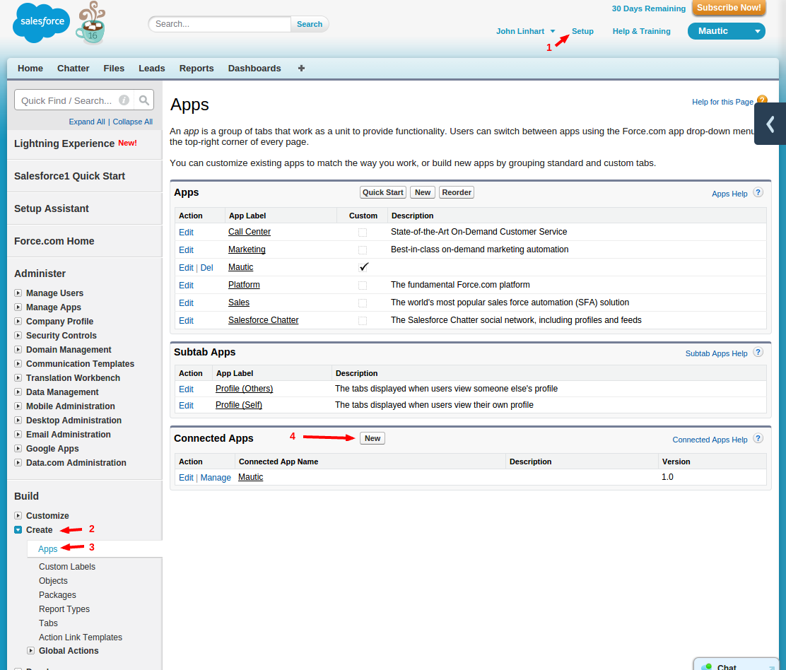
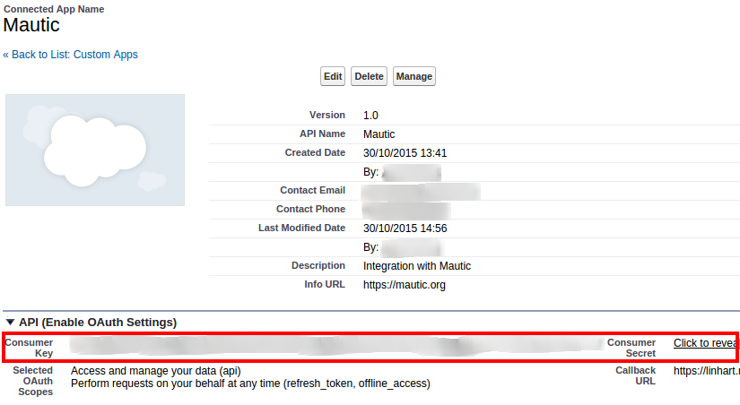
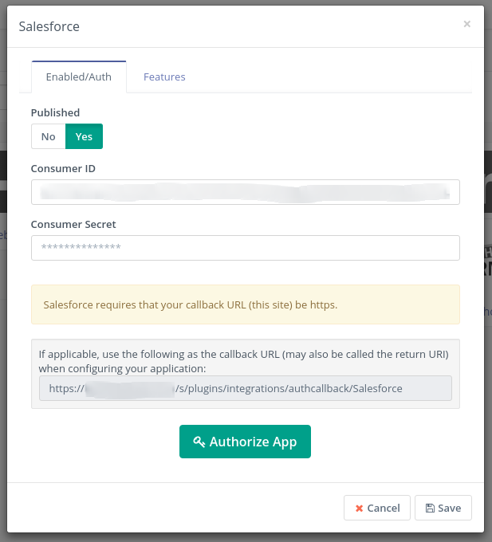
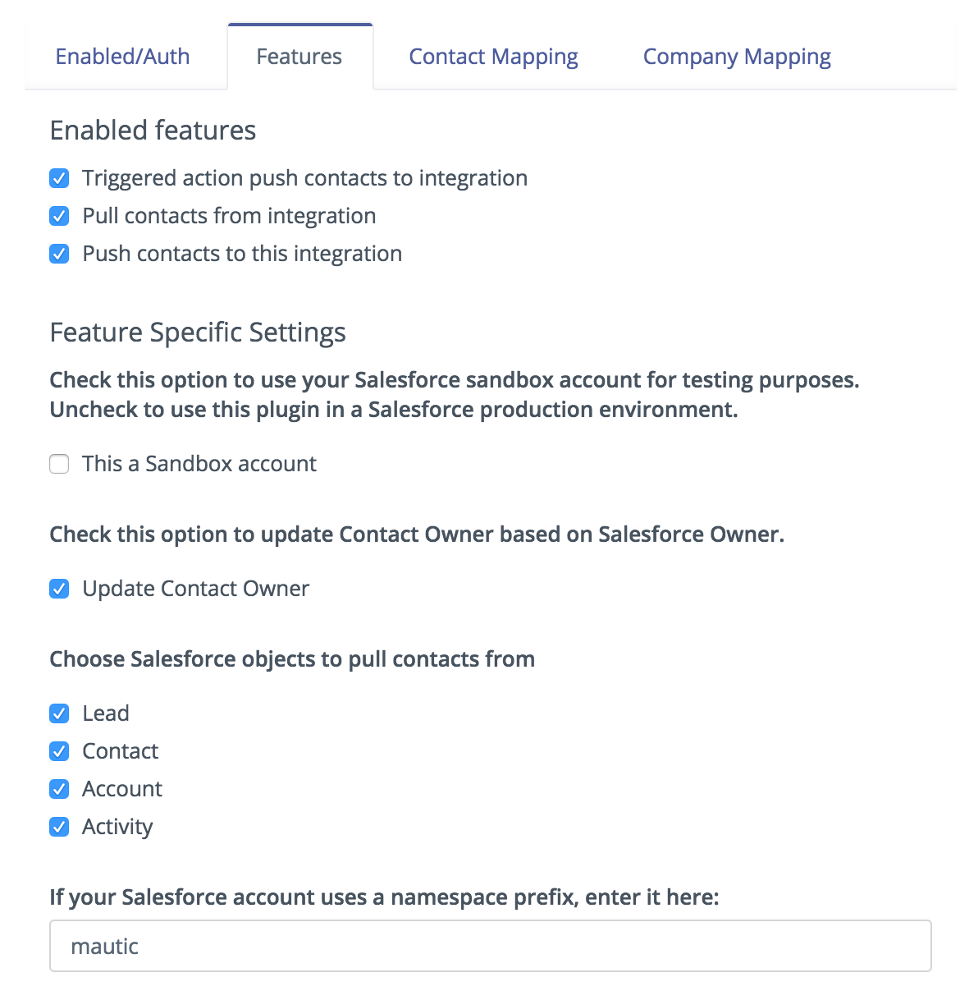

# Mautic - Salesforce CRM plugin

This plugin can push a contact to Salesforce CRM when a contact makes some action. If you don't have the Salesforce CRM account yet, [create it](http://www.salesforce.com/).

## Requirements

SSL. Your Mautic instance has to run on https. Salesforce will not allow you to create an App with just an http callback URL.

## Get the Salesforce client credentials

There is an [official documentation](http://feedback.uservoice.com/knowledgebase/articles/235661-get-your-key-and-secret-from-salesforce) about how to get the Key and Secret although it doesn't seem to be updated.

Go to: *Setup* (top right corner) / Build (bottom left corner) - Create / Apps / Connected Apps / New

Create a new app like this:

Make sure the Selected OAuth Scopes are *Access and manage your data (api)* and *Perform requests on your behalf at any time (refresh_token, offline_access)*.

Copy the Consumer Key and Secret.

## Configure the Mautic Salesforce plugin

Insert the keys to the Mautic Salesforce plugin and authorize it.

Configure the [field mapping](./../plugins/field_mapping.html).
Formula fields from salesforce will be pulled and can be saved into a Mautic custom field.
Salesforce lead's Id can be matched with a mautic custom field.

### Features
Enabled features:
You can pull leads and/or push leads from and to the integration.

Push leads is done through a form or a campaign.

Pull leads is done through command line and it can be setup as a cronjob.

Feature specific settings:
Select the objects you wish to pull or push records from. You can push contacts to the Leads object in salesforce. You can also push activities (contact's timeline records) to a custom object in salesforce.

Pulling records will be done from Leads and/or Contacts objects in records and Accounts from Salesforce will be pulled into Mautic companies.

Updating of a Contact's Owner can be be enabled by turning on *Update Contact Owner*. This is not enabled by default. In order for a Contact in Mautic to match a User in Salesforce the email addresses in the two systems must be identical.

### Command line script to pull records from Salesforce
To pull records from salesforce you need to use a command from CLI. Use this command:

Used to pull records from the Leads object in Salesforce

- php app/console mautic:integration:fetchleads

Used to push activities to the Salesforce custom object described below
 - mautic:integration:pushleadactivity

Parameters both commands take:

**--time-interval** This parameter is used to setup the amount of time we want to pull records from. Possible entries: "10 days", "1 day", "10 minutes", "1 minute".  Maximum time interval "29 days".

**--integration**=Salesforce  to use with salesforce integration.  In future this command may be used for other integrations.

## Setting up Mautic's custom object in Salesforce
To be able to push activities to the salesforce integration you first need to setup a custom object in your salesforce instance. Please setup the object as it is described below.  (Note: these are two underscores with no space between - not rendered well in Github).

Custom object name: Mautic\__timeline (API  name: Mautic_timeline\__c)

API names of fields:
- ActivityDate\__c : Date/Time
- contact_id\__c : Lookup(Contact)
- Description\__c  : Long Text Area(131072)
- WhoId\__c : Lookup(Lead)
- MauticLead\__c : Number(18, 0) (External ID)
- Mautic_url\__c : URL(255)
- ReferenceId     : Text(255)

When enabling the activity object, you need to tick the Activity checkbox in the mautic plugin configuration and also specify the namespace prefix specified in Salesforce

## Salesforce Campaigns and Mautic
Mautic can communicate with Salesforce campaigns through trigger actions in Mautic campaigns and forms, and through Mautic segments.

In Mautic campaigns:
In a campaign you can choose to push contacts to a specific Salesforce campaign, from the configuration window you can select the campaign and the status you wish your campaign members to have when inserted to the Salesforce campaign.  Follow similar procedure for a form action to push to salesforce integration.

In Mautic Segments:
You can create a mautic segments composed of contacts that are in a Salesforce campaign. To do this create a segment filter Integration Campaign Member option, then in the filter properties select the name of the campaign you wish to get campaign members from.

## Test the plugin

Follow [these steps](./../plugins/integration_test.html) to test the integration.

## Troubleshooting

### Error: `The REST API is not enabled for this Organization.`

This means the API is not turned on in your Salesforce account. [Read more](https://help.salesforce.com/apex/HTViewHelpDoc?id=admin_userperms.htm&language=en)
