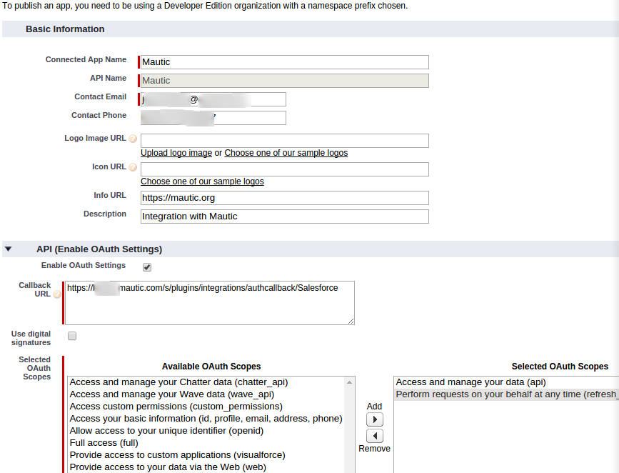
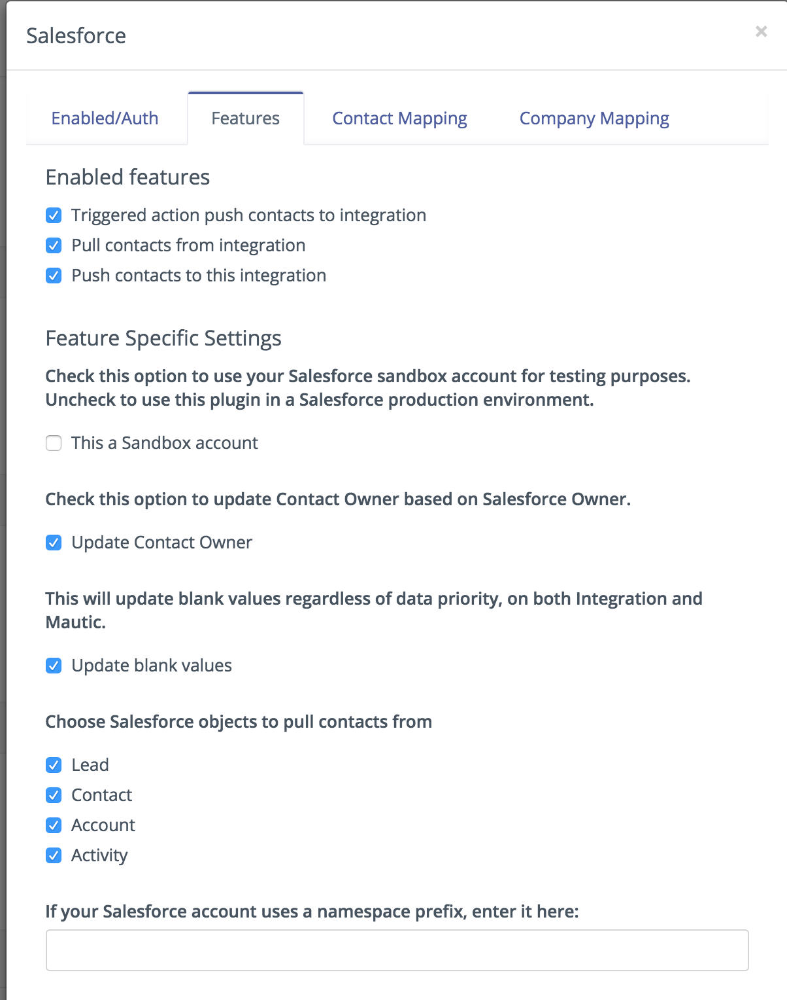
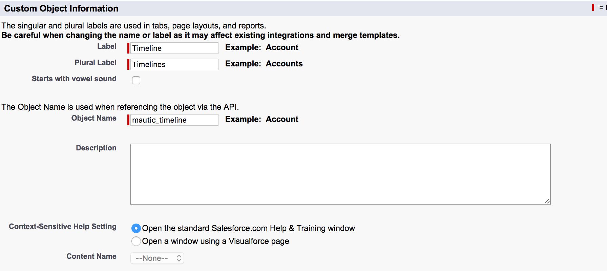
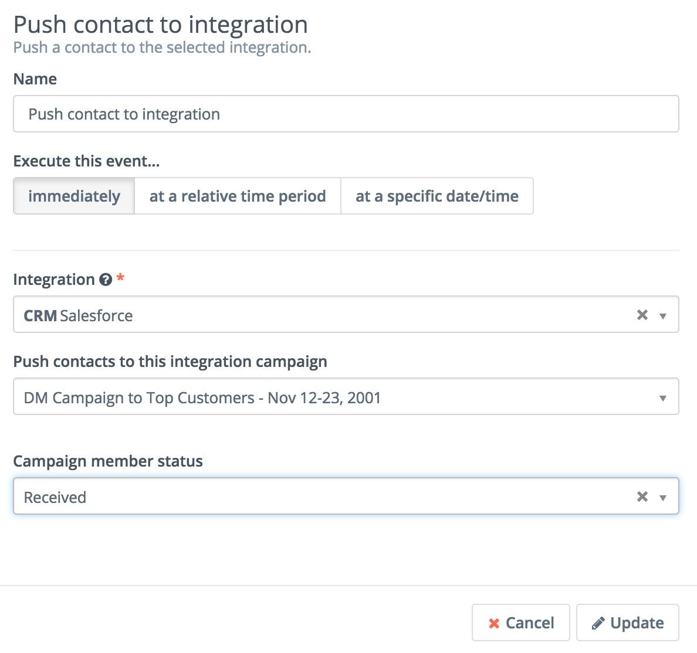
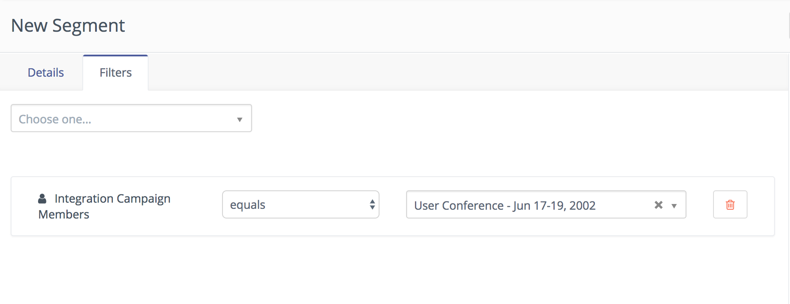

# Mautic - Salesforce CRM plugin

This plugin can push a contact to Salesforce CRM when a contact makes some action. If you don't have the Salesforce CRM account yet, [create it](http://www.salesforce.com/).

## Requirements

SSL. Your Mautic instance has to run on https. Salesforce will not allow you to create an App with just an http callback URL.

## Get the Salesforce client credentials

There is an [official documentation](http://feedback.uservoice.com/knowledgebase/articles/235661-get-your-key-and-secret-from-salesforce) about how to get the Key and Secret although it doesn't seem to be updated.

Go to: *Setup* (top right corner) / Build (bottom left corner) - Create / Apps / Connected Apps / New

Create a new app like this:

Make sure the Selected OAuth Scopes are *Access and manage your data (api)* and *Perform requests on your behalf at any time (refresh_token, offline_access)*.

Copy the Consumer Key and Secret.

## Configure the Mautic Salesforce plugin

Insert the keys to the Mautic Salesforce plugin and authorize it.

Configure the [field mapping](./../plugins/field_mapping.html).
Formula fields from salesforce will be pulled and can be saved into a Mautic custom field.
Salesforce lead's Id can be matched with a mautic custom field.

### Features
Enabled features:
You can pull leads and/or push leads from and to the integration.

Push leads is done through a form or a campaign.

Pull leads is done through command line and it can be setup as a cronjob.

**Feature specific settings:**

- Sandbox - when using a sandbox account to test, Mautic will use the test url for the API provided by Salesforce.
- Updating of a Contact's Owner can be be enabled by turning on *Update Contact Owner*. This is not enabled by default. In order for a Contact in Mautic to match a User in Salesforce the email addresses in the two systems must be identical.
- If Update blanks is checked, the sync will: 1. When pulling contacts from Salesfoce: it will check for fields mapped fields in Mautic and it will update these fields with Salesforce data regardless of the arrow direction set in the configuration. 2. When pushing data to Salesforce it will check for blank mapped fields in Salesforce and it will update these with Mautic's data regardless of the directions of the arrows setup in the configuration.
- Select the objects you wish to pull or push records from. 
- You can push Mautic contacts to the Lead and Contact object in Salesforce. You can also push activities (contact's timeline records) to a custom object in salesforce.
- Pulling records will be done from Leads and/or Contacts objects into contacts in Mautic and Accounts from Salesforce will be pulled into Mautic companies.

### Command line script to pull records from Salesforce
To pull records from salesforce you need to use a command from CLI. Use this command:

Used to pull records from the Leads object in Salesforce

- php app/console mautic:integration:fetchleads

Used to push activities to the Salesforce custom object described below
 - mautic:integration:pushleadactivity

Parameters both commands take:

**--time-interval** This parameter is used to setup the amount of time we want to pull records from. Possible entries: "10 days", "1 day", "10 minutes", "1 minute".  Maximum time interval "29 days".

**--integration**=Salesforce  to use with salesforce integration.  In future this command may be used for other integrations.

## Setting up Mautic's custom object in Salesforce
To be able to push **contact timeline** activities to the salesforce integration you first need to setup a custom object in your salesforce instance. Please setup the object as it is described below.  (Note: these are two underscores with no space between - not rendered well in Github).
In this example Salesforce has given the custom object a namespace name = 'Mautic__'. We will describe the name of the fields and object that result after completing the process of creating the custom object.

(_use the text in bold when creating your custom fields_)

Custom object name: (namespace)**mautic_timeline**; (API  name: Mautic__**mautic_timeline**\__c)

API names of fields: 
- **ActivityDate**\__c : Date/Time
- **contact_id**\__c : Lookup(Contact)
- **Description**\__c  : Long Text Area(131072)
- **WhoId**\__c : Lookup(Lead)
- **MauticLead**\__c : Number(18, 0) (External ID)
- **Mautic_url**\__c : URL(255)
- **ReferenceId**\__c     : Text(255) (This field must be set as a unique field in SF to prevent duplicating activity entries)

When enabling the activity object, you need to tick the Activity checkbox in the mautic plugin configuration and also specify the namespace prefix if it's available in Salesforce

You can filter what contact timeline activities to push to your custom object in Salesforce using the **Events to include in the activity sync** selector. If this is left blank all activity types will be pushed to your activity object in Salesforce.

## Salesforce Campaigns and Mautic
Mautic can communicate with Salesforce campaigns through trigger actions in Mautic campaigns and forms, and through Mautic segments.

### In Mautic campaigns
In a campaign you can choose to push contacts to a specific Salesforce campaign, from the configuration window you can select the campaign and the status you wish your campaign members to have when inserted to the Salesforce campaign.  Follow similar procedure for a form action to push to salesforce integration.

### In Mautic Segments
You can create a mautic segments composed of contacts that are in a Salesforce campaign. To do this create a segment filter Integration Campaign Member option, then in the filter properties select the name of the campaign you wish to get campaign members from.

## Syncing Salesforce Email Opt Out with Mautic Do Not Contact

### Prepare Salesforce

In Salesforce, make sure the "Email Opt out" field is visible to edit and that field history tracking has been set for the Email Opt Out field.

a. Under the Setup menu, go to Build -> Customize then do the following for each of Lead and Contact's layouts

b. Add the Email Opt Out field

c. Continue by going to the customise fields

d. Select the email opt out field and edit the field level security option

e. Check to see if the field is visible at all levels if its not select it and save

f. Setup Field history by going to the setup->Customize->Leads->Fields menu (also the Contacts fields menu) and set history tracking on the Email Opt Out fields

### Prepare Mautic

1. In Mautic's configuration for Salesforce on the Features tab, check the box to `Use latest updated Do Not Contact record`.
2. Map the Salesforce `Email Opt Out` field to Mautic's `Do not contact by email` field
3. Now the do not contact status will update the other system 

## Test the plugin
Follow [these steps](./../plugins/integration_test.html) to test the integration.

## Troubleshooting

### Error: `The REST API is not enabled for this Organization.`

This means the API is not turned on in your Salesforce account. [Read more](https://help.salesforce.com/apex/HTViewHelpDoc?id=admin_userperms.htm&language=en)
