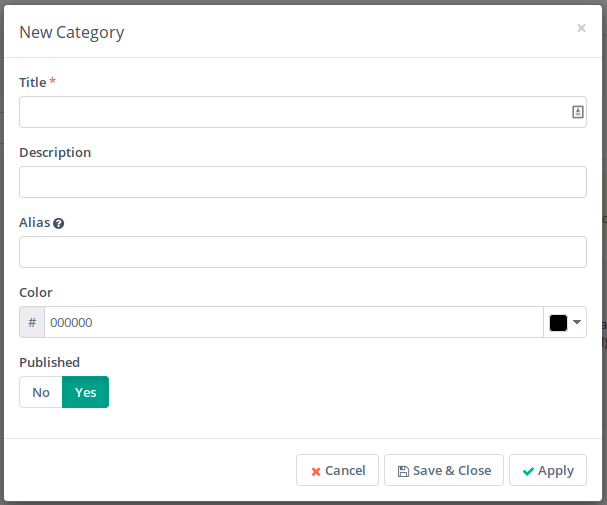

# アセットの管理
## カテゴリー
アセットは，あなたが簡単にリソースを検索することを可能にし，カテゴリとして整理することができます。新しいカテゴリを作成するには、アセットのセクションを参照し，'カテゴリの管理'をクリックします。

### カテゴリーの作成
新しいカテゴリーを作成するには画面右上にある '新規作成' をクリックしてください

Name the category something that reflects the 'filing system' structure that will be used, and provide a short description of the category.

The alias field will be automatically populated from the title field unless manually specified - this is used to create the URL path so it should ideally contain hyphens instead of spaces.

It is possible to color-code individual categories by either typing in a hex code, or using the picker to select the color.

To publish a category and make it available for assigning assets, 'yes' should be highlighted - if the category should not be published click on 'No' to set the category as unpublished.

To save the changes and continue editing, press 'Apply'.  To save the changes and go back to the categories screen, press 'Save & Close'.  To cancel changes and return to the categories screen, press 'Cancel'

### Editing categories

To edit a category, either click on the category name, or click on the arrow beside the checkbox and select 'edit'.  The same screen as above will be displayed, however the fields which have previously been populated will already have content - which can be edited and saved as above.

### Managing categories

Categories can be sorted by title or ID.  Click on the column header to search by the required field - clicking again will reverse the sort order.

At the bottom of the page, a dropdown allows control over the number of categories displayed per page - if this number is exceeded by the amount of categories, the pagination arrows can be used to move between pages.  To change the number of categories displayed, select the desired number from the dropdown and the page will automatically refresh.

### Deleting categories

Categories can be deleted by clicking on the arrow beside the checkbox and selecting delete.  If any assets are currently assigned to the category being deleted, they will not be removed, but will instead display as 'Unassigned'.  A warning will be displayed which alerts you to this fact when deleting a category.

## Assets

Assets are often provided as incentives to complete a form, and may include white papers, infographics, videos, mp3's and so forth.  These are made available within Mautic as a downloadable file which may be instantly downloaded on submission of a form, or provided as a link from which it can be accessed.

To create an asset, first establish any categories that may be needed and ensure that they are published - it is not possible to assign assets to unpublished categories.

Navigate to 'Manage Assets', and click 'New' to begin creating an asset.

Assets can be added from local resources on a computer or from a remote location.  Local uploads will be restricted by size due to the settings of your server - any such restriction may be advised as a warning above the file upload area.

### Uploading an asset

To upload an asset, either drag the file into the white box, or click in the white box to open a file upload window.  On selection of the file, it will be automatically uploaded and will appear in the white box.  

The title of the asset can be set, along with a description and an alias as above with categories.  Assets can only be assigned to published categories, therefore the dropdown list for category selection will not feature unpublished categories.  It is also possible to set the language, whether the asset is published or unpublished, and whether it should become published or unpublished at a specific date or time.

When the details have been completed, click 'Save & Close' or 'Apply' to save changes to the asset.

### Viewing an asset

Once an asset has been uploaded and saved, it can be viewed by clicking on the asset name in the list of assets.

The view asset screen gives information about the number of times the asset has been downloaded, which can be displayed on a chart by hourly, daily, weekly, monthly or yearly downloads.  The graph also shows the number of unique, versus total views - this is an indication of whether the same asset is being downloaded multiple times by some visitors.

A download URL allows previewing of the asset - clicking on the link will open the asset in a new window.

Below the preview link will be displayed recent activity for this resource, with a preview of the resource being available beneath the chart for some formats.

### Editing an asset

An asset can be edited by clicking on the 'edit' button while viewing the asset, or by selecting the arrow next to the checkbox for the asset, and selecting 'edit'.  The edit screens are the same as the view screens, however content will be populated in the fields.

### Deleting an asset

An asset can be deleted by clicking on the 'delete' button while viewing the asset, or by selecting the arrow next to the checkbox for the asset, and selecting 'delete'.  A confirmation screen will be displayed, prompting confirmation that the asset should be deleted.

Once an asset has been deleted, it cannot be retrieved, and statistics relating to the number of downloads for that asset will no longer be available.  Lead points that may have been accumulated as a result of accessing the resource will remain. It is recommended where possible to unpublish assets which are no longer in use - in future there may be an archive feature.

